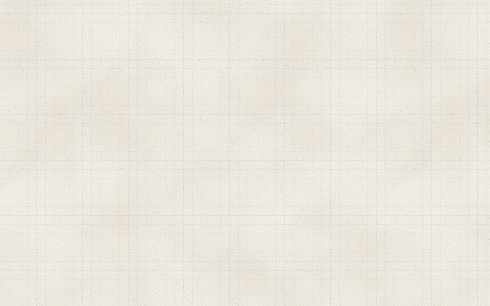
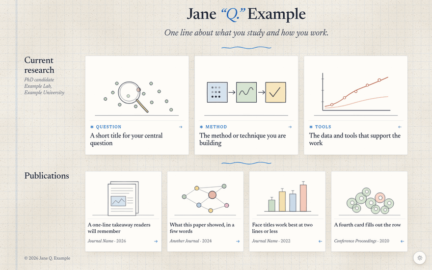
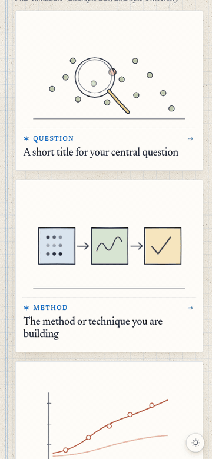
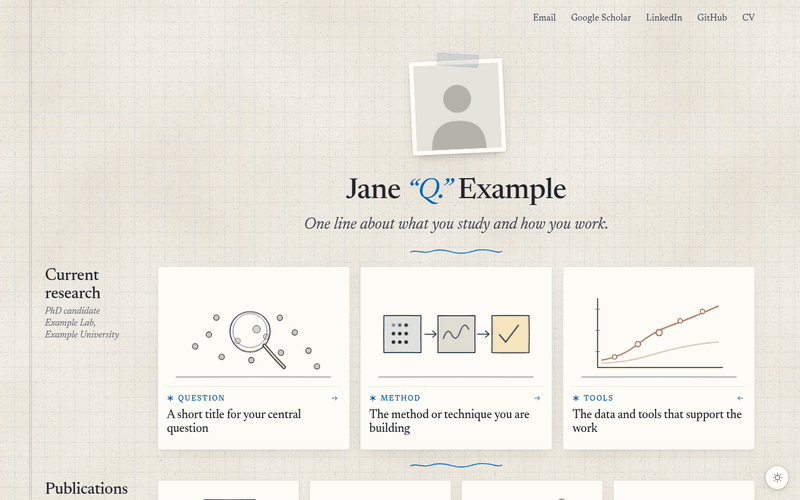
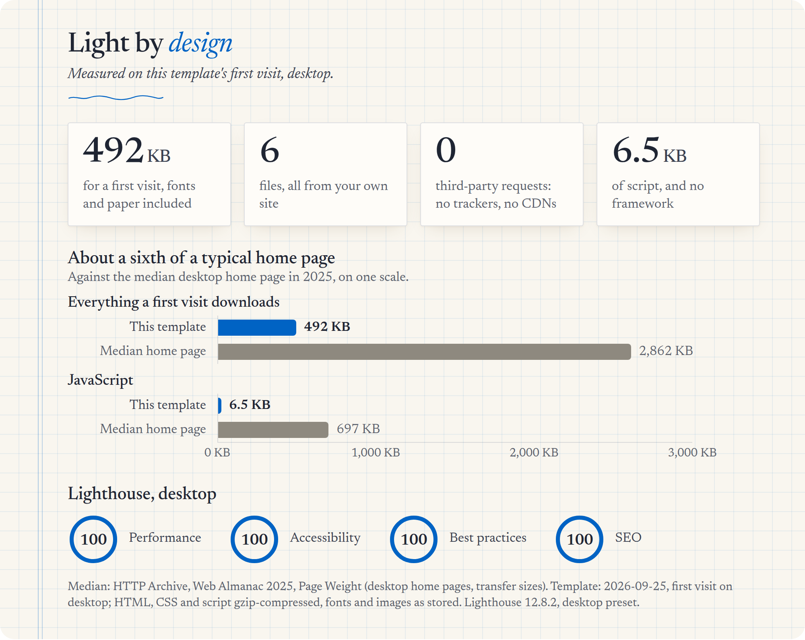
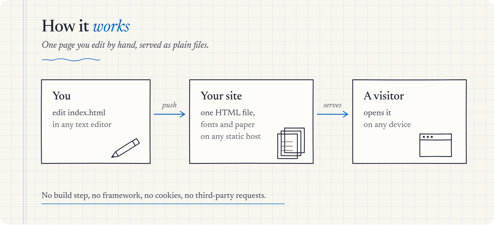

<p align="center">
  <picture>
    <source media="(prefers-color-scheme: dark)" srcset=".github/readme/hero-dark.gif">
    
  </picture>
</p>

<h1 align="center">Notebook</h1>

<p align="center">
  <b>A hand-drawn homepage for researchers.</b><br>
  One HTML file&nbsp;·&nbsp;no build step&nbsp;·&nbsp;free to host&nbsp;·&nbsp;nothing that tracks your visitors
</p>

<p align="center">
  <a href="https://zhongqilin.org"><b>See it live</b></a>&nbsp;&nbsp;·&nbsp;&nbsp;<a href="#set-up-in-three-steps"><b>Set up in three steps</b></a>&nbsp;&nbsp;·&nbsp;&nbsp;<a href="#make-it-yours">Make it yours</a>
</p>

<br>

## Why it's nice

- **It feels made by hand.** Graph paper, a taped snapshot, ink dividers, and small drawings that quietly move.
- **Your work, one click deep.** Each project and paper is a card. Open one and its story unfolds right beside it.
- **Fast and private.** About half a megabyte, no framework, no cookies, not a single request to anyone else's server.
- **Yours to edit.** Everything is plain HTML in one file. Nothing to install, nothing to learn.

## See it in action

<p align="center">
  
  <br>
  <sub><b>Cards that unfold.</b> Open a card and its details slide out sideways while its neighbours fold into spines.</sub>
</p>

<table>
  <tr>
    <td width="40%" align="center" valign="top">
      
    </td>
    <td valign="top">
      <h3>Made for phones</h3>
      <p>On a small screen the details open in a drawer under the card, and the layout follows the space it really has, from a 320&nbsp;px phone to a 4K monitor.</p>
      <h3>Light and dark</h3>
      <p>It follows the reader's system setting. The switch in the corner flips it with a soft cross-fade.</p>
      
      <h3>Kind to every reader</h3>
      <p>Keyboard and screen-reader friendly, and all motion stops for anyone who asks their system for less.</p>
    </td>
  </tr>
</table>

## By the numbers

<p align="center">
  <picture>
    <source media="(prefers-color-scheme: dark)" srcset=".github/readme/numbers-dark.png">
    
  </picture>
</p>

<details>
<summary>The same numbers as a table</summary>
<br>

| | This template | Median desktop home page, 2025 |
|---|---:|---:|
| Everything a first visit downloads | 492 KB | 2,862 KB |
| JavaScript | 6.5 KB | 697 KB |
| Files | 6, all from your own site | |
| Third-party requests | 0 | |

Lighthouse 12 (desktop): Performance 100 · Accessibility 100 · Best practices 100 · SEO 100.

Measured on a first visit, with HTML, CSS and script gzip-compressed and fonts and images as stored. The median comes from the [HTTP Archive Web Almanac 2025, Page Weight](https://almanac.httparchive.org/en/2025/page-weight).
</details>

## How it works

<p align="center">
  <picture>
    <source media="(prefers-color-scheme: dark)" srcset=".github/readme/how-dark.png">
    
  </picture>
</p>

## Set up in three steps

1. **Get your copy.** Click **Use this template** (or **Fork**) at the top of this page.
2. **Make it yours.** Open `index.html` and replace the placeholders: search for `Jane`, `Example` and `your-`. Swap in your photo, links, projects and papers ([what goes where](#make-it-yours)).
3. **Put it online.** In your copy, open **Settings → Pages** and choose **Deploy from a branch → `main` → `/ (root)`**. About a minute later it's live at `https://<you>.github.io/<repo>/`.

That's all. For your own domain, see [Cloudflare](#optional-your-own-domain-on-cloudflare).

To preview on your computer first, run `python3 -m http.server` in the folder and open <http://localhost:8000>.

## Make it yours

Everything lives in **`index.html`**, in plain HTML.

| What | Where |
|---|---|
| **Name, tagline, photo** | `<h1 data-name>` (text inside `<i>` turns blue), `<p data-tagline>`, and ``. Put your square photo in `assets/` and point `src` at it. |
| **Links** | `<nav data-icons>` at the top: Email, Scholar, LinkedIn, GitHub and CV. Put your CV at `assets/your-cv.pdf`. |
| **Research cards** | `<ul data-shelf="now">`. Each `<li data-item>` is one card: a drawing, a kind label and a title, plus a question and a short paragraph in its details. |
| **Papers** | `<ul data-shelf="pub">`. Each card has a short title, journal and year, and in its details the full title, authors (wrap your name in `<b>`), a summary and a link. |
| **Search and sharing** | `<head>`: title, description, the `og:*` / `twitter:*` tags and the JSON-LD block. Replace `assets/og-card.png` (1200×630), `favicon.ico`, `assets/favicon-192.png`, `robots.txt` and `sitemap.xml`. |

<details>
<summary>Adding or removing cards</summary>
<br>

The rows are sized for 3 research cards and 4 papers. To change that:

1. Copy or delete a whole `<li data-item>` block.
2. Give a new card a unique `data-k` and matching ids (`zl8p-f-<k>`, `zl8p-t-<k>`, `zl8p-d-<k>`).
3. Add the key to the `SHELVES` list in the script at the bottom.
4. Add a `view-transition-name` line for it next to the others (search for `zl-f-now1`).

A different count per row also means adjusting `--n`, `--face` and the 956 px breakpoint in the CSS.
</details>

<details>
<summary>Drawings</summary>
<br>

Each card's drawing is an inline SVG with a 360×225 viewBox. The placeholders use the page's ink palette through CSS variables (`--sk-ink`, `--sk-ink-soft`, `--sk-paper`, `--sk-sage`, `--sk-gold`, `--sk-sky`, `--sk-clay`, `--sk-rose`, `--sk-accent`), so a drawing that uses them switches with light and dark by itself. Any part with a `data-anim` attribute and a CSS animation keeps moving; it pauses under reduced motion, while its card is folded, and during the load intro.
</details>

## Optional: your own domain on Cloudflare

GitHub Pages is enough to publish, and it takes a custom domain too (**Settings → Pages → Custom domain**). Cloudflare is the other option: a small Worker (`worker/index.js`) serves the same files with security headers and sends `www` to your bare domain.

<details>
<summary>Cloudflare setup</summary>
<br>

1. **Connect the repository** (**Workers & Pages → Create → Connect to Git**). Each push to `main` then deploys.
2. **Add your domain** under **Workers & Pages → your project → Settings → Domains & Routes**. If you serve both `example.com` and `www.example.com`, set `APEX_HOST` at the top of `worker/index.js` to `example.com`, and `www` will redirect to it.
3. **Optional: Google Search Console.** Uncomment the `google-site-verification` tag in `index.html`, paste your token, and submit `sitemap.xml`.

To run it locally with the Worker: `npx wrangler dev`.
</details>

<details>
<summary>Privacy</summary>
<br>

- **Nothing is tracked.** No cookies, no analytics, no visit or download counts.
- **The page calls no one else.** The fonts are self-hosted, and there are no CDNs or third-party scripts.
- **The Worker keeps nothing.** It adds headers and the `www` redirect, and stores no data.
</details>

<details>
<summary>What's in the box</summary>
<br>

```
.
├── index.html          the whole page: content, styles and a small script
├── assets/
│   ├── headshot.svg    placeholder photo (replace)
│   ├── og-card.png     1200×630 link-preview card (replace)
│   ├── favicon-192.png site icon (replace)
│   ├── tex-*.webp      the paper's grain
│   └── fonts/          Newsreader and EB Garamond, self-hosted (SIL Open Font License)
├── favicon.ico
├── robots.txt, sitemap.xml
├── worker/index.js     optional Cloudflare Worker: security headers, www redirect
├── wrangler.jsonc      its configuration
└── .github/readme/     the pictures on this page (not deployed)
```
</details>

## License

[MIT](LICENSE). The fonts keep their own SIL Open Font License (texts in `assets/fonts/`).
